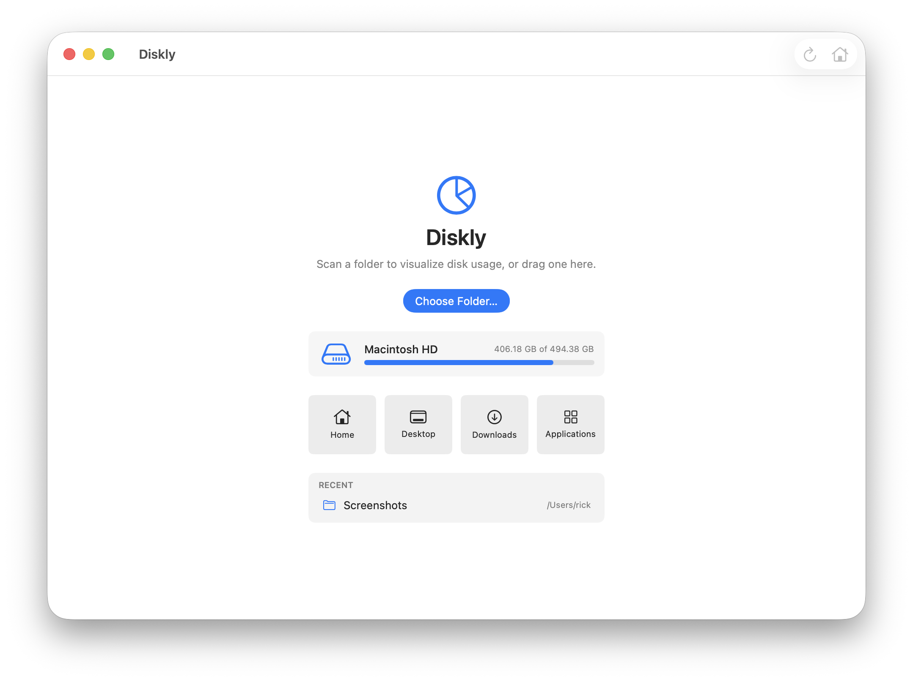
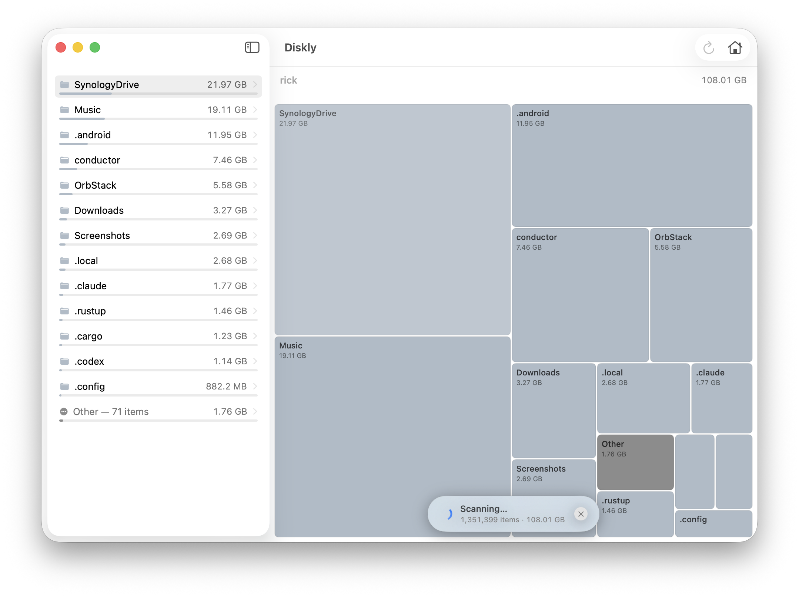
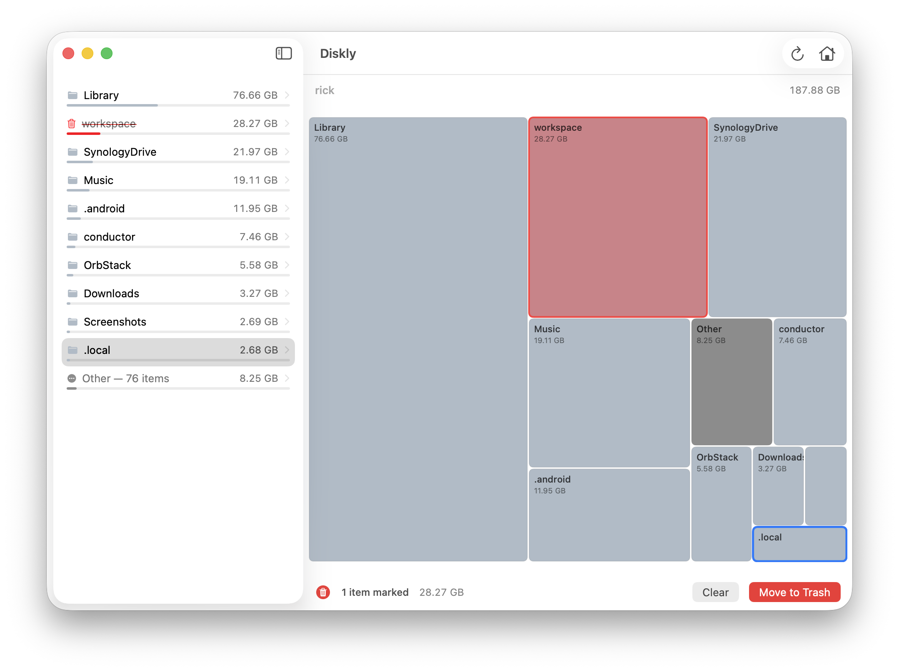

# Diskly

A fast, native macOS disk usage visualizer.

Pick a folder and Diskly draws a squarified treemap of what's eating your space,
with a sortable size breakdown alongside it. Mark the junk, review it, send it to
the Trash in one pass.

## Screenshots

<table>
  <tr>
    <td></td>
    <td></td>
    <td></td>
  </tr>
  <tr>
    <td align="center"><sub>Home</sub></td>
    <td align="center"><sub>Scan</sub></td>
    <td align="center"><sub>Delete</sub></td>
  </tr>
</table>

## Install

Download the latest build from [GitHub releases](https://github.com/noxan/diskly/releases/latest),
unzip it, and drag Diskly to Applications.

## Features

- **Treemap** — every file sized by disk usage, colored by type; click to select,
  double-click or the chevron to drill in, breadcrumb to navigate back.
- **Size breakdown** — sidebar list of the current folder's contents, largest first.
- **Mark & clean** — stage items for deletion (shown in red), review the total, then
  Move to Trash together.
- **Fast scans** — directories scanned in parallel across cores, with a live item
  count and Cancel.

## Build & run

```sh
make open      # build and launch
make share     # build a zip to share with others
make dist      # signed + notarized release (needs config.mk)
```

Requires macOS 26+ and Xcode 26+. The app is sandboxed and only accesses folders
you explicitly choose.
